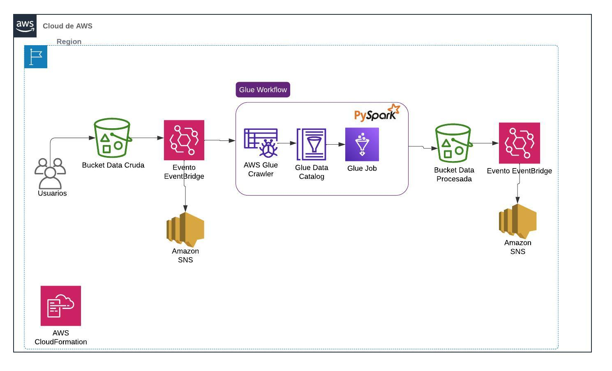

# 🚀 Proyecto Integrado: Automatización de Procesamiento de Datos con AWS Glue y PySpark🚀

En este nuevo proyecto, se demuestra cómo la integración de AWS Glue, PySpark, EventBridge, y Amazon S3 puede optimizar el procesamiento y la gestión de grandes volúmenes de datos.

**Objetivo del Proyecto:** El desafío principal era diseñar e implementar un flujo de trabajo automatizado para el procesamiento de datos utilizando AWS Glue, activado por eventos en Amazon S3. Este flujo no solo maneja el almacenamiento y procesamiento de datos, sino que también asegura una integración fluida y eficiente entre los servicios de AWS.

Este proyecto fue desarrollado para satisfacer las necesidades de una empresa ficticia, y la estimación de costos se realizó con base en los requerimientos específicos utilizando AWS Pricing Calculator.

------------



## Herramientas y Tecnologías Utilizadas:

- **Almacenamiento de Datos:** Amazon S3
- **Procesamiento de Datos:** AWS Glue (Jobs y Workflows) y PySpark
- **Eventos y Automatización:** AWS EventBridge
- **Notificaciones:** AWS Lambda y SNS
- **Arquitectura**: CloudFormation

## Etapas Clave del Proyecto:

1. **Configuración de Buckets en S3:**
    - **Data Cruda:** Se crea un bucket para almacenar la data cruda que se ingresa a través de eventos.
    - **Data Procesada:** Se configura otro bucket para almacenar la data después de ser procesada por Glue.
2. **Implementación de AWS Glue:**
    - **Crawler y Data Catalog:** Configuré un Crawler para catalogar los datos y prepararlos para el procesamiento.
    - **Jobs y Workflows:** Implementé Jobs y Workflows en AWS Glue para transformar y procesar los datos de acuerdo con los requerimientos del negocio.
3. **Automatización con EventBridge:**
    - **Reglas de Evento:** Configuré reglas en EventBridge para activar automáticamente los Jobs y Workflows de Glue cuando se cargan nuevos datos en el bucket de S3.
4. **Notificaciones con Lambda y SNS:**
    - **Función Lambda:** Implementé una función Lambda para enviar notificaciones cuando se cargan nuevos objetos en S3.
    - **SNS:** Utilicé SNS para gestionar las publicaciones y notificaciones sobre los eventos de carga de datos.

## **Estimación de Costos:**

Para ajustar el presupuesto a los requerimientos específicos de la empresa ficticia, se realizó una estimación de costos utilizando AWS Pricing Calculator:

## Obten este proyecto clonando el repositorio:

1. Navega hasta el directorio donde quieres clonar el repositorio usando el comando cd en la terminal.
2. Usa el comando git clone, como:

```bash
git clone https://github.com/JAlexCastro/Pipeline-de-procesamiento-de-datos-en-AWS.git
```
